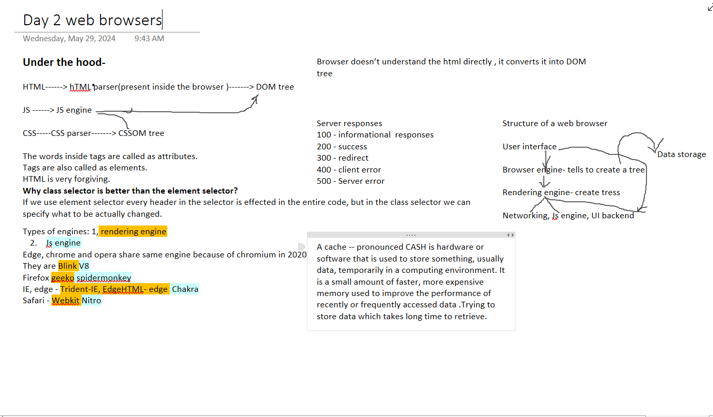

# HTML🩻


Hypertext Markup Language- defines the meaning and structure of web content

"Hypertext" refers to links that connect web pages to one another

"markup" to annotate text, images, and other content for display in a Web browser.

HTML consists of a series of **elements**, which you use to enclose.

## Anatomy of Html element


Attributes contain extra information about the element that you don't want to appear in the actual content.

You can put elements inside other elements too — this is called nesting.

## Void Elements

A void element is an element in HTML that cannot have any child nodes (i.e., nested elements or text nodes). Void elements only have a start tag; end tags must not be specified for void elements.

```$$

<area>
<base>
<br>
<col>
<embed>
<hr>

<input>
<link>
<meta>
<param>
<source>
<track>
<wbr>
```

[**Anatomy of a html doc**](https://developer.mozilla.org/en-US/docs/Learn/Getting_started_with_the_web/HTML_basics#anatomy_of_an_html_document)

## Images

```python

```

1.src (source) attribute, which contains the path to our image file.

2.alt (alternative) attribute specify descriptive text for users who cannot see the image, [SEO](https://searchengineland.com/guide/what-is-seo) purposes.

## Headings

HTML contains 6 heading levels, h1 to h6

```python
<!-- 4 heading levels: -->
<h1>My main title</h1>
<h2>My top level heading</h2>
<h3>My subheading</h3>
<h4>My sub-subheading</h4>
```

## Paragraphs

```python
<p>This is a single paragraph</p>
```

# Style HTML using CSS 😎

**Cascading Style Sheets** — or CSS. CSS is not a programming language, is a _style sheet language_.

You can use CSS to alter the font, color, size, and spacing of your content, split it into multiple columns, or add animations and other decorative features.

```python
p {
  color: red;
}

```


This whole structure is called as ruleset.

     1.Apart from the selector, each ruleset must be wrapped in curly braces. ({})

    2.Within each declaration, you must use a colon (:) to separate the property from its value or values.

    3.Within each ruleset, you must use a semicolon (;) to separate each declaration from the next one.

## [Different types of selectors](https://developer.mozilla.org/en-US/docs/Learn/Getting_started_with_the_web/CSS_basics#different_types_of_selectors)

Element selector (sometimes called a tag or type selector)- p
selects < p >

Class selector The element(s) on the page with the specified class. Multiple instances of the same class can appear on a page.

```python
.my-class
selects <p class="my-class"> and <a class="my-class">
```

CSS layout is mostly based on the box model. Each box taking up space on your page has properties like:

**padding**, the space around the content.

**border**, the solid line that is just outside the padding.

**margin**, the space around the outside of the border.

[Positioning and styling the main page title](https://developer.mozilla.org/en-US/docs/Learn/Getting_started_with_the_web/CSS_basics#positioning_and_styling_the_main_page_title)

[Centering the image](https://developer.mozilla.org/en-US/docs/Learn/Getting_started_with_the_web/CSS_basics#centering_the_image)



[Mdn cheatsheet](https://www.datacamp.com/cheat-sheet/markdown-cheat-sheet-23)

# Intro to JS 👋

JavaScript was created in the first place for DOM manipulation.

JavaScript (JS) is a lightweight interpreted programming language with first-class functions.

JavaScript and java are **NOT SAME**. The relation between java and js is like car and carpet.

The standards for JavaScript are the ECMAScript Language Specification.

Reassign can be allowed in Var, let and cannot be allowed in const.

**Reassigning**- giving an other value to the variable.

**Redeclaration**- creating a variable again

**Redeclare** cannot be done by **let, const** but done by the **var**.

Reassign can be done by **var**, **let** and not by the **const**

> But const can still be changed why?

```python
const marks = [80,79,90];
marks[1]= 20;
console.log(marks);

```

We are not replacing address of marks but giving it a new value , So this can be possible.

Address cannot be changed in the const.

```python
const t1 =[ 30,40,50]
        const t2=t1;
        const t3= [30,40,50];
        t1.push(80);
        t2.push(90);
        t3.push(70);
        console.log(t1);
        console.log(t2);
        console.log(t3);
```

In this case

## Scope

In general, life time of a variable defines that area of that variable where it gets the access

let and const both are block scope. Var is called a function scope, But why var is also working?

```python
        {
        var x1= 10;
        let x2=20;
        }
        console.log(x1);
        console.log(x2);
```

var is printed as 10 , but let cannot be printed a 20 . Instead it prints not-defined.

Undefined is a value

Not defined is an error

```python

function driving(age){
             if(age>18){
                 let msg ="eligible";
             }
             else{
                 let msg = "not eligible";
             }
             console.log("you are" +msg);
         }
         driving(20);

```

in this case not defined is the output, // Both are not defined now, because function is more tuffer block.

### Type casting

Implicit coercion

```python
var x1 = 3;
var x2 = "5";
console.log(x1+x2);
console.log(x1-x2);
```

this is operator overloading. The ouput is 35, -2

Here "+" prefers concatenation over addition( because tc39 wrote those protocols to concatenate instead of addition), and "-" has only one option to Subtract

Explicit coercion

```python
var x1 = 3;
var x2 = "5";
console.log(x1+parseint(x2));
console.log(x1+ +x2);
```

[] + [] will be an empty string "".

null + 5 equals 5
