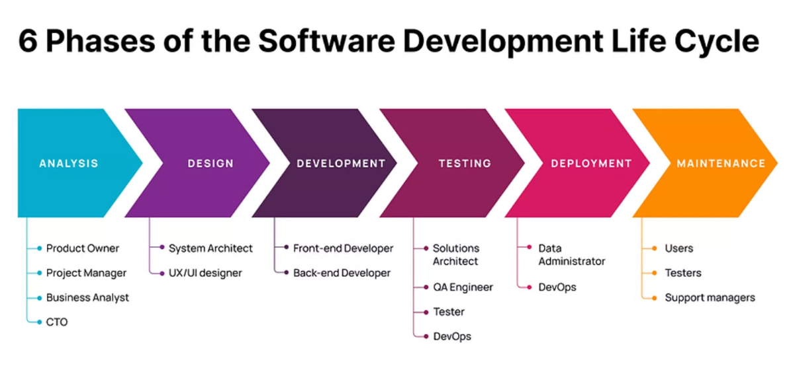
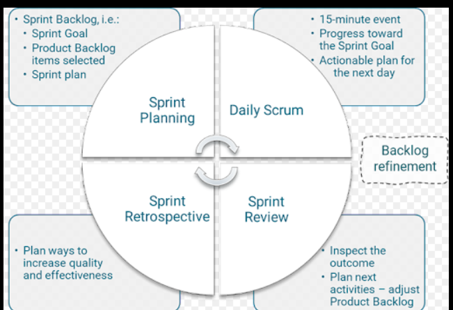
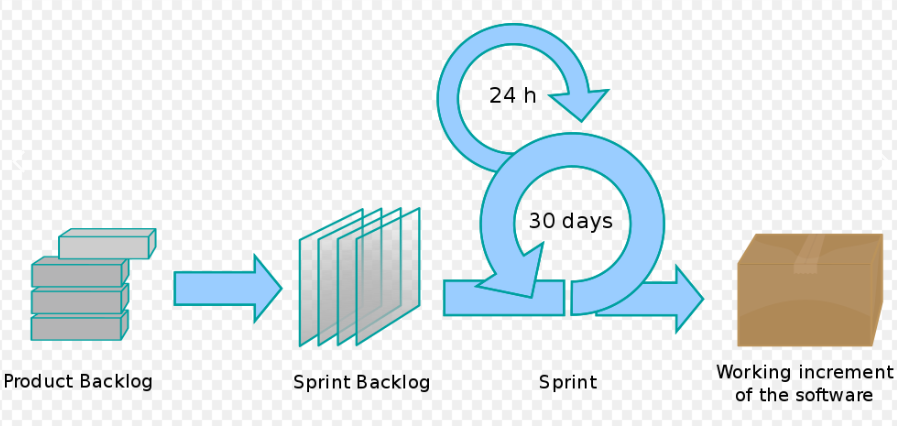
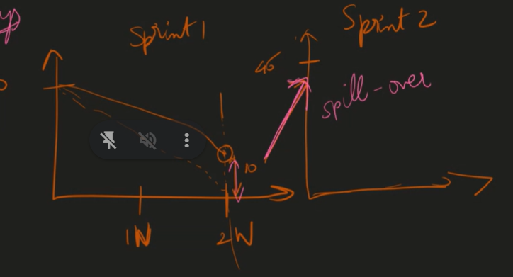
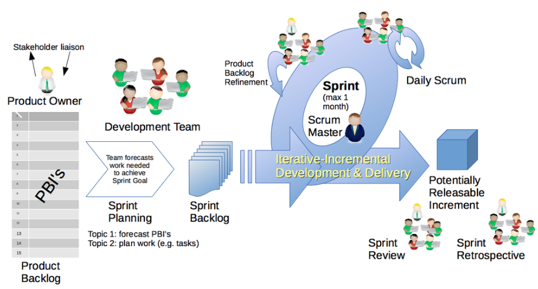
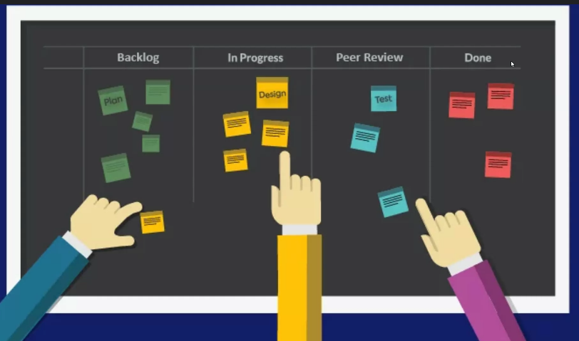

# What is SDLC?

A life cycle model represents all the methods required to make a software product transit through its life cycle stages.

Without using an exact life cycle model, the development of a software product would not be in a systematic and disciplined manner.

1. Planning- Ideation
2. Analysis- is it technical possible, business and technical analysis
3. Design- figma is the standard, Adobe Xd- designing is like the drawing the broader stroke . Any correction can be done easily in this part of the cycle.
4. Implementation- is done by the developers
5. Testing and integeration - done by the QA team
6. Maintenance - customer support

System Architect - he is the one who fixes the quality, tailor making the app , they should know all the things about FE , BE,

Why do you need visual representation?

simplifies complex ideas and data and makes them easy to understand

> auto layout

> variants ,, learn these two things, to master designing. use figma (color theory)

**STakeholders**- If anything goes wrong in the product their collars will be pulled first. or called first, they hold the entire responsibilty, holding a stake,

## Agile

Its an iterative process

1. CEO
2. Project manager

3. Designer

4. CTO
5. Front End, Back End
6. Testing
7. FE, BE integration
8. Devops
9. customer feedback
10. Bugs
11. backend dev or FE fix the bug
12. regression test
13. Devops redeploy

## Diff between the service and product based company

when I have multiple customers then , it is a product based company
Service products
Netflix is a product based company

A product-basedcompany focuses on selling physical goods to customers.

DFS is product based, BFS is the service based

## Diff between the waterfall and Agile model

> When to choose the waterfall model?

When you have a clear picture of your final product, the waterfall methodology is a good fit. It works if you know the exact customer requirements and are sure that the needs will not change.

If you’re working under strict time or budget constraints, waterfall should be your choice.

Migration projects where the requirement is clear, it takes min of the 6 months period

We have 2 release cycles. but in agile 12 releases, in a month 2 sprints are done. 1 sprint for develoment and other is for the testing.

## implementation of the agile- Scrum

1. **Scrum** - An agile approach like scrum is all about "adaptive planning, evolutionary development, and early(and often )delivery.

theme of this model is to keep the end user’s satisfaction in mind. For that, you must work closely with customers and keep including their feedback in the product development.

'

**Sprint**- it happens in 2 weeks, Design, develop, test, deploy working incerement.

**Sprint planning(1hr)**---> is for filling the 14 days of time , calender fixing and that should be full. And the assigned people provides the story points

Bug fixing is done in the second sprint

**Story points** the time required to complete the task. story points are generally fibonacci number.(1,2,3,5,8). Stry points are looked by manager

**Burn down chart** A burn down chart is a graph that shows the work left to do versus the time left to do it. It is a project management tool that helps to track the progress and predict the completion date of the project.

**Spillover** a spillover occurs when tasks designated for a particular sprint aren't finished within the set timeframe, consequently carrying over into subsequent iterations.

**Standup**: 10-15 min, what did you do yesterday, what will you do today.

**Blocker**--> when someone is stuck somewhere and they cannot move forward

**Sprint review**– a collaborative meeting to consider what was accomplished in a sprint and what the next steps should be. It’s a working session and is timeboxed, usually for four hours for a one-month sprint (less for shorter sprints).

**Retrospective** – a regular, continuous improvement activity where the team looks at how they can work together more effectively – ‘what went well’, ‘what didn’t’, ‘things to try’ etc.

Kanban board is a tool to manage the scrum. It gives shape to the agile. It tells what priority is assigned, what all are completed, backlogs, etc.

Reviewer checks the code quality.

After the process is done by the dev team testing team picks up the tickets and is assigned to QA lead.

## References

[Agile vs waterfall](https://apifuse.io/blog/agile-vs-waterfall-methodology/)

[Agile vs waterfall table diff](https://www.guru99.com/waterfall-vs-agile.html)
